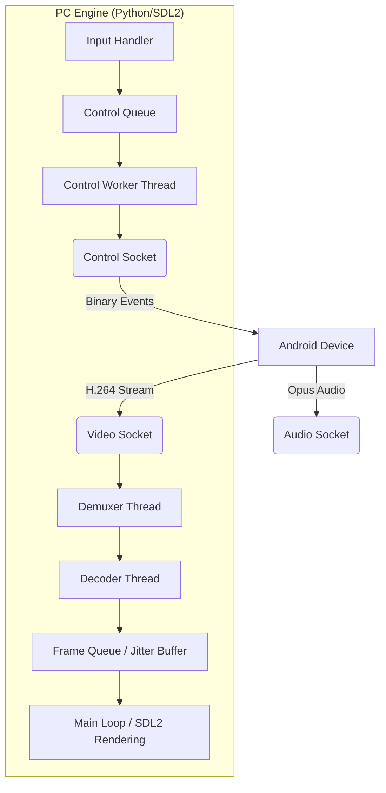

# 🏗️ Arquitetura do Sistema

O Furious Mirror é construído sobre uma arquitetura multi-threaded assíncrona, garantindo que a interface do usuário (GUI) nunca trave, independentemente da carga de rede.

## Fluxo de Dados Macro

## Componentes de Software

### 1. Orquestrador (`furious.py`)
O "cérebro" do app. Ele gerencia o ciclo de vida de todas as threads e coordena a comunicação entre o `Server` e a `Screen`.

### 2. Gestor de Servidor (`server.py`)
Responsável pela ponte ADB. Ele realiza o "push" do `furious-core.jar` para o dispositivo e inicia o processo `app_process` no Android, configurando bitrates e opções de controle.

### 3. Motor Gráfico (`screen.py`)
Abstração do SDL2. Gerencia a janela nativa, texturas YUV aceleradas por hardware e o sistema de "Smart Scaling" que protege contra janelas maiores que o monitor.

### 4. Gestor Sem Fio (`wireless.py`)
Implementa um sistema de mensagens Win32 nativo para o Tray Icon e gerencia a lógica de transição TCP/IP.

## Gestão de Threads
Para manter a latência zero, o app utiliza as seguintes threads independentes:
- **Main Thread**: Loop de eventos SDL2 e Renderização.
- **Demuxer Thread**: Leitura contínua do socket de vídeo.
- **Audio Thread**: Processamento e playback de áudio.
- **Control Thread**: Envio de comandos de toque/teclado.
- **Monitor Thread**: Monitoramento passivo de performance.
